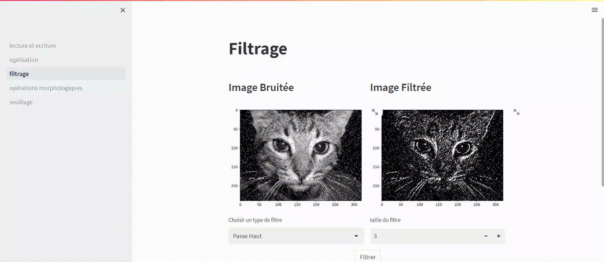

# Image Processing Software
This is a mini collaborative project exposing the main image processing operations such as reading, writing, equalization, filtering ...
# 
To start the project , all you have to do is run the following command :
``` Shell
streamlit run lecture_et_ecriture.py 
```
# Demo

<table align="center">
  <tr><td align="center"><b>Reading and Writing a pgm file</b></td></tr>
  <tr><td></td></tr>
       <tr><td align="center"><b>Image Equalization</b></td></tr>
       <tr><td ></td> </tr>
        <tr><td align="center"><b>Image Filtering</b></td></tr>
       <tr><td ></td> </tr>
     <tr><td align="center"><b>Morphological Operations</b></td></tr>
       <tr><td ></td> </tr>
       <tr><td align="center"><b>Thresholding</b></td></tr>
       <tr><td ></td> </tr>
 </table>
 
